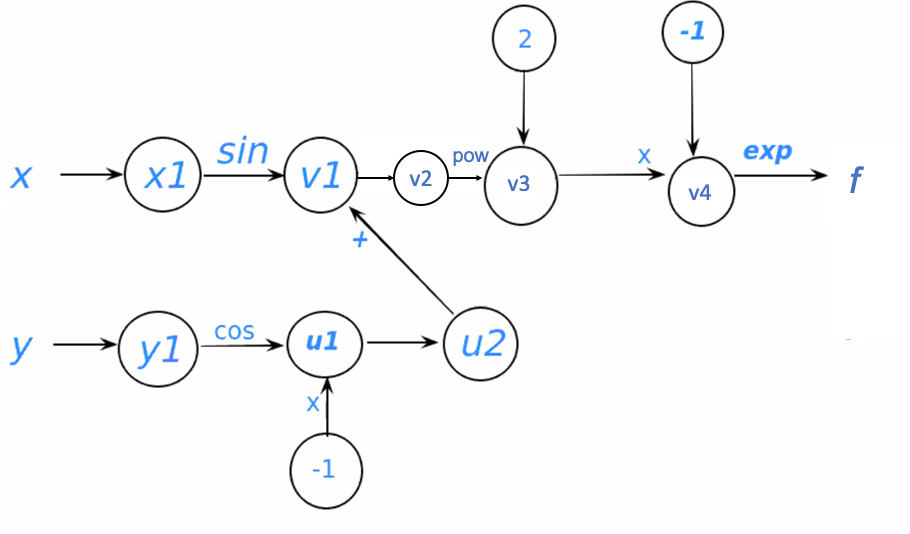

# Pair programming 6

coder: Ruizhe Kang
listener: Will Wang
sharer: Yingchen Liu

1. computational graph for the function

2. evaluation trace for this function

|Trace|Elementary operation |Numerical value| 
|--|--|--|
|x1|pi/2|1.57|
|v1|sin(x1)|1.00|
|y1|pi/3|1.05|
|u1|cos(y1)|0.50|
|u2|-u1|-0.50|
|v2|u2+v1|0.50|
|v3|v22|0.25|
|v4|-v3|-0.25|
|f|exp(v4)|0.78|
 

3. f(pi/2,pi/3)=0.78

4. We'll extend the table to calculate the derivatives

|Trace|Elementary operation | numerical value of the function  |derivative of the elementary function|numerical value of the derivative respect to x| numerical value of the derivative respect to y|
|--|--|--|--|--|--|
|x1|pi/2|1.57|1|1|0|
|v1|sin(x1)|1.00|cos(x1) \dot{x1}|0.804|0|
|y1|pi/3|1.05|1|0|1|
|u1|cos(y1)|0.50|-sin(y1) \dot{y1}|0|-0.804|
|u2|-u1|-0.50|-\dot{u1}|0|0.804|
|v2|u2+v1|0.50|\dot{u2}+ \dot{v1}|0.804|0.804|
|v3|v22|0.25|2v2 \dot{v2}|0.804|0.804|
|v4|-v3|-0.25|-\dot{v3}|-0.804|-0.804|
|f|exp(v4)|0.78|exp(v4) \dot{v_4}|-0.627|-0.627|
